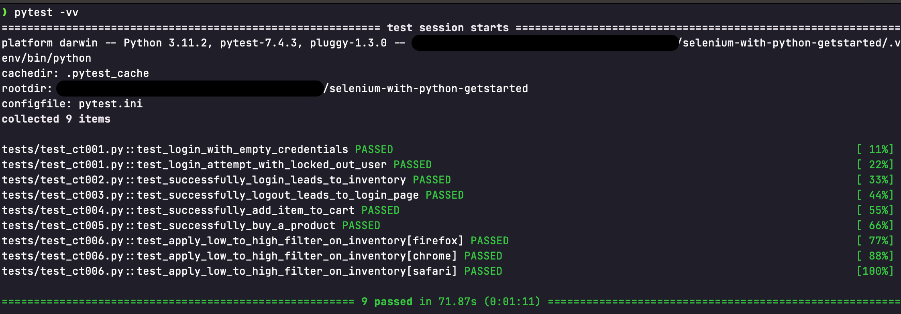

# Get started: Selenium + pytest

Automated tests using Python flavor of the Selenium framework.

- [Get started: Selenium + pytest](#get-started-selenium--pytest)
- [How to install](#how-to-install)
  - [Initial setup](#initial-setup)
  - [Configure dependecies](#configure-dependecies)
- [How to execute tests](#how-to-execute-tests)
  - [Expected output of test run](#expected-output-of-test-run)
  - [Selecting a specific browser](#selecting-a-specific-browser)
  - [Set a default browser to run a specific test](#set-a-default-browser-to-run-a-specific-test)
  - [Using `pytest` parametrize option to repeat test on different browsers](#using-pytest-parametrize-option-to-repeat-test-on-different-browsers)
  - [Using containers to run tests](#using-containers-to-run-tests)


# How to install

## Initial setup

First things first: This is a Python project. So you need to make sure to have Python installed.

```shell
# Verify your local python version installed:
python3 --version
```

> The recommended version is `Python 3.11.2`. Follow the [official docs](https://www.python.org/downloads/) to install it, if you need.

This project also recommends the use of ***virtual environment*** to handle the dependency isolation. Feel free to [read the official documentation](https://docs.python.org/3/library/venv.html#creating-virtual-environments) for more information about it.

## Configure dependecies

Use the following steps to configure this project of Test Automation:

```shell
# clone this project from GitHub
git clone git@github.com:thiagojacinto/selenium-with-python-getstarted.git

# chage to your brand new local repository directory
cd selenium-with-python-getstarted

# create a Python virtual enviroment and activate it (UNIX compatible)
python3 -m venv .venv \
    && source .venv/bin/activate

# install the dependencies from the lock, that guarantee the same dependencies verisons:
pip install -r requirements-lock.txt
```

# How to execute tests

Once configured, to execute the tests, go to the project directory then type:

```bash
pytest

# You can use pytest -vv for a more verbose test output
```

## Expected output of test run

An output like this is expected after the tests are all run:



## Selecting a specific browser

You may want to use a specific browser to run the tests, therefore use the following argument to achieve this:

```bash
pytest --use-browser firefox
```

The supported browser options list is [described here](https://github.com/thiagojacinto/selenium-with-python-getstarted/blob/3329a51fa38d473f2519c0caf01c3a63e30cbba2/conftest.py#L5C28-L5C28). And with `pytest -h`, you can find more about this option:
```
Custom options:
  --use-browser=USE_BROWSER
        Define the browser to be executed. Current supported versions: chrome, firefox, safari, headless-chrome, headless-firefox, headless-safari
```

## Set a default browser to run a specific test

You can also set a default browser to run the tests by using a custom Pytest's Mark, as the exemple below:

```python
@pytest.mark.FORCE_BROWSER("firefox")
def test_successfully_run_with_firefox(...):
  ...
```

The test above will be run using the Firefox browser and this mark takes precedence over the CLI argument `--use-browser`, if it is passed.

## Using `pytest` parametrize option to repeat test on different browsers

It's useful to use the powers of `pytest` framework to handle situations where the specific test case should be run against a variety of different browsers. A way to make it works it's by using `pytest.mark.parametrize` fixture, as the example below:

```python
@pytest.mark.parametrize(
        (""), [
            pytest.param(id="default"), 
            pytest.param(id="firefox", marks=pytest.mark.FORCE_BROWSER("edge")),
            pytest.param(id="firefox", marks=pytest.mark.FORCE_BROWSER("chrome"))
            ]
    )
def test_successfully_run_with_edge_chrome_and_default_config(...):
  ...
```
The way the example above works is by only applying:
- an _ID_: to be displayed on the pytest output;
- the custom `FORCE_BROWSER` mark: to force the use of the specified browser. 

## Using containers to run tests

To rapidly set a development environment, using Docker to run containers is a valid alternative. Documentation for `docker-selenium` is set on the [project official repository](https://github.com/SeleniumHQ/docker-selenium) and it might be a good idea to take some time to read it.

The first steps are condensed on this [Makefile](Makefile), and you could start with the `make help` command to see the basics to: put containers UP or DOWN with Docker, then execute the tests on this infrastructure. All containers configuration are disposed on [compose.yaml](containers/compose.yaml)

```sh
make help
# > These are all the avalaible commands ...

make se-docker-up # starts the docker containers set by containers/compose.yaml file

make se-docker-run-tests #Running tests for Firefox, Chrome and Edge browsers from docker containers

make se-docker-down # terminates the docker containers set by containers/compose.yaml file
```